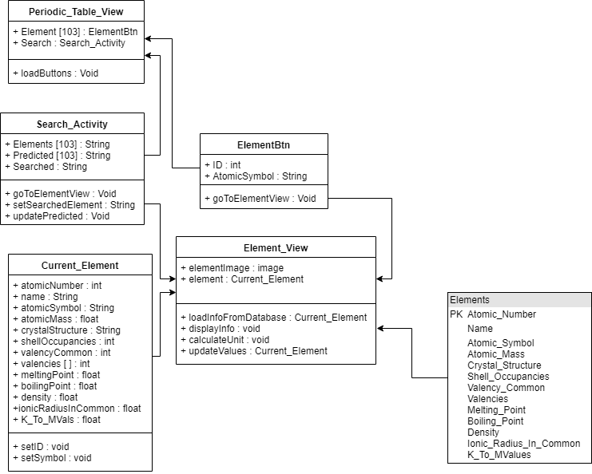
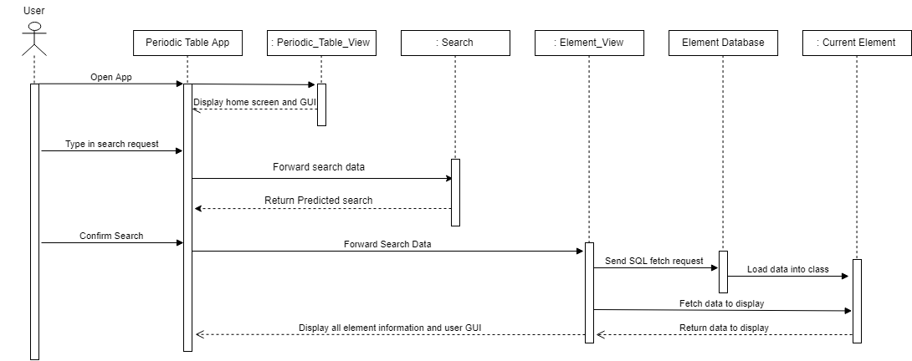

# OO Design and UML
#### High-Level Architecture Diagram:

The _'Periodic table app'_ represents the main high level systems within the app. The user will interact with the interactive GUI. Anything the user can do will have an associated _'Event Handler'_ to deal with user inputs. Depending on if the user decides to search, or click on an element button, this is passed to the relevant section. Each of these will then access the database via the _'Database open helper class'_ and the _'Database Access Class'_. These two classes open the database file (we are not using a web based server as the client wants the app to be offline) and deal with the SQL requests required to pull the necessary information.  

The _'Element Database'_ represents the local database file that holds the element information that we will load in to show to the user. Only needed information is fetched at any time using SQL fetch requests. The database is not active or web based due to the app needing to be offline via the client's request.

#### Static UML diagram:

This diagram shows the relationships between the classes that are needed for the user to search for a specific element within the app.

Our motivation for modelling this aspect of the system was the fact that it is the most complex part of the app from a technical point of view. This is because we will be using a database to hold the specific information about each element, and at some point we will need to retrieve this data and display it for the user.

There was some uncertainty about how the _'Search_ _ _Activity'_, _'Current_ _ _Element'_, and _'Element_ _ _View'_ will interact with each other, and specifically where the SQL fetch request will be sent from. Drawing up the static UML diagram helped us to visualise the working of the system, and decide that the most logical place for the database to be accessed from would be the  _'Element_ _ _View'_ class. This decision was made on the basis that both the classes mentioned above interact with _'Element_ _ _View'_, and also it will be the activity where the fetched data is displayed for the user.  

Modelling the search aspect using a static UML diagram allowed us to see the relationships between each class, and helped us think about the methods and variables needed for them. Additionally, having represented this part of our system visually allows us to convey how we have designed our classes to interact with each other much easier, improving communication within the team.  
Making our static UML diagram has shown us how many classes are required to make an efficient system, in addition to giving us insight on how we may distribute the workload between our team when coding the application.  

#### Dynamic UML diagram:

This diagrams dictates how the program flows when a user is searching for a specific element to view in more detail.  

We chose to model this aspect of our program because it is the most complex system within our application. Due to our use of a database within the app to store the element data, we needed to visualise which class the SQL fetch request will be sent from, and where the corresponding data will be sent to, as we were uncertain of these specifics to begin with. To improve readability, and to abstract the element data into one place, we decided to implement the _'Current_ _ _Element'_ class. The SQL fetch request will be sent from the  _'Element_ _ _View'_ class, with the data returned from the database loaded into the _'Current_ _ _Element'_ class. There will only ever be one instance of this class; if multiple elements are viewed in the same session, the variables in _'Current_ _ _Element'_ will be overridden.  
Additionally, the client wished for the search to have predictive functionality. We came up with two possible ways to implement this; SQL requests or string matching algorithm. Collectively, we decided to go with a string matching algorithm due to there already needing to be a data file with all element names. The data that we will need to string match on will therefore already be loaded into the application. The use of the dynamic UML diagram aided in this decision, as it requires less data passing throughout the program, which should hopefully improve both the predictive search speed and the efficiency of the program as a whole.

Modelling the searching aspect of our system using a dynamic UML diagram helped us to visualise the data transfer and interaction between the classes within our application, and also how the user inputs are handled and passed to the correct classed.  
Creating this dynamic UML diagram has taught us how much interaction and data transfer is required within our application. Initially we thought that there would be two transfers of data, however it has become apparent that much more will need to happen to make an efficient system.
