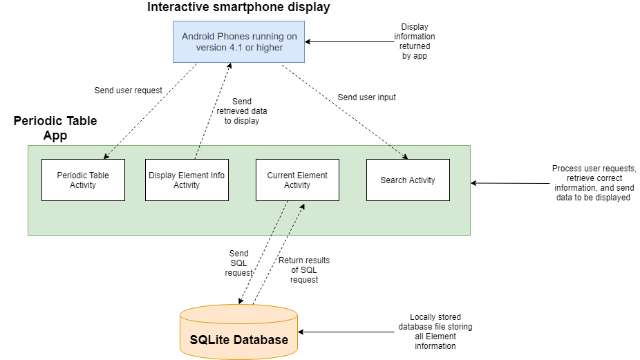
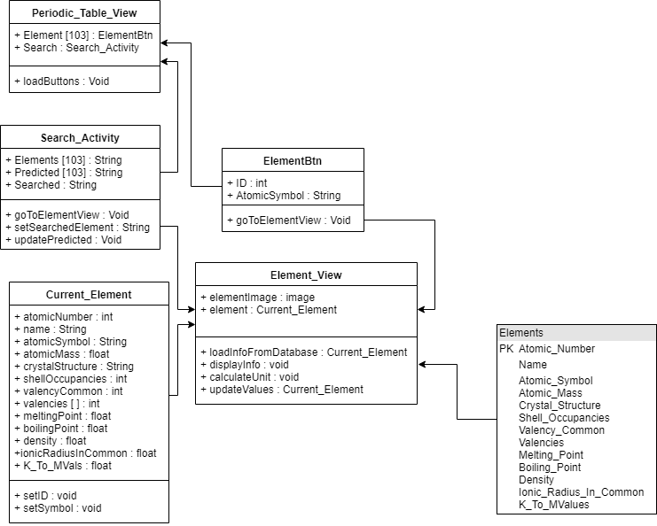
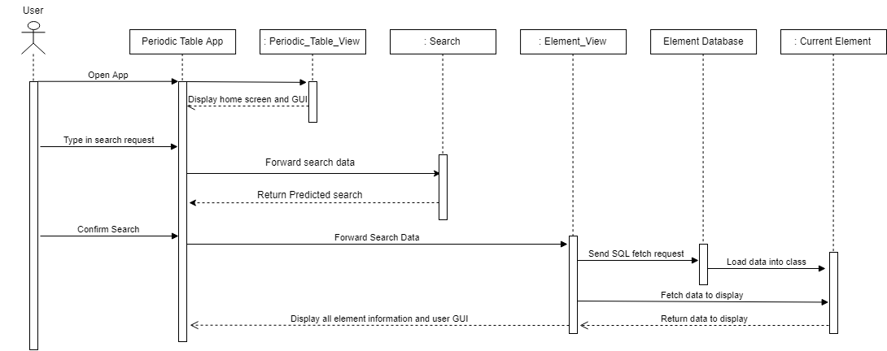

# OO Design and UML
#### High-Level Architecture Diagram:

Our application has been designed to be a stand alone system, with the only input or output being that to a locally stored SQLite database file. This is where all data and information about each element is stored. We thought for an app of this nature that using a web based database server was adding unnecessary components to our system, and would prevent the app performing its simple function without an internet connection, not to mention the cost of running and maintaining a web based database. SQLite was chosen for our database due to its simplicity to set up, and how easy it is to integrate into android applications with the use of a few small libraries. The only other external component would be that of the smartphones touchscreen. This is how users will interact with all aspects of our application.

Within the Periodic Table App there are four main activities that interact with other systems outside the application. The _'Periodic Table Activity'_ is where a user's selection of which element they wish to view is received through a physical tap on the smartphone's touchscreen. This selection is then passed onto the _'Current Element Activity'_ which sends an SQL request to the SQLite database. The result of this query is returned to the _'Current Element Activity'_, where it is then passed onto the _'Display Element Info Activity'_. This activity presents the data in a user friendly, readable fashion, and sends this data to the smartphone's screen for the user to receive. The _'Search Activity'_ operates in much the same way, however the user inputs a selection through an onscreen keyboard instead of tapping to select which element they wish to view.

#### Static UML diagram:

This diagram shows the relationships between the classes and activities that are needed for the user to access the information for a specific element within the app, when they choose to do so.

Our motivation for modelling this aspect of the system was the fact that it is the most complex part of the app from a technical point of view. This is because we will be using a database to hold the specific information about each element, and at some point we will need to retrieve this data and display it for the user. Data retrieval is needed either when the user uses the search bar or if they select which element they want to view via the smartphone touchscreen. A new class is needed for the user to view the information regarding the element. Due to these factors, modelling this integral part of the system is important to gain an understanding of how the most used activities within the app work with each other.

There was some uncertainty about how the _'Search_ _ _Activity'_, _'Current_ _ _Element'_, and _'Element_ _ _View'_ will interact with each other, and specifically where the SQL fetch request will be sent from. Drawing up the static UML diagram helped us to visualise the working of the system, and decide that the most logical place for the database to be accessed from would be the  _'Element_ _ _View'_ class. This decision was made on the basis that both the classes mentioned above interact with _'Element_ _ _View'_, and also it will be the activity where the fetched data is displayed for the user.  

Modelling the search aspect using a static UML diagram allowed us to see the relationships between each class, and helped us think about the methods and variables needed for them. Additionally, having represented this part of our system visually allows us to convey how we have designed our classes to interact with each other much easier, improving communication within the team.  
Making our static UML diagram has shown us how many classes are required to make an efficient system, in addition to giving us insight on how we may distribute the workload between our team when coding the application.  

#### Dynamic UML diagram:

This diagrams dictates how the program flows and the user's request is processed when they are using the search bar to look up an element they wish to gain information on.  

We chose to model this aspect of our program because it is the most complex system within our application. Due to our use of a database within the app to store the element data, we needed to visualise which class the SQL fetch request will be sent from, and where the corresponding data will be sent to, as we were uncertain of these specifics to begin with. To improve readability, and to abstract the element data into one place, we decided to implement the _'Current_ _ _Element'_ class. The SQL fetch request will be sent from the  _'Element_ _ _View'_ class, with the data returned from the database loaded into the _'Current_ _ _Element'_ class. There will only ever be one instance of this class; if multiple elements are viewed in the same session, the variables in _'Current_ _ _Element'_ will be overridden.  
Additionally, the client wished for the search to have predictive functionality. We came up with two possible ways to implement this; SQL requests or string matching algorithm. Collectively, we decided to go with a string matching algorithm due to there already needing to be a data file with all element names. The data that we will need to string match on will therefore already be loaded into the application. The use of the dynamic UML diagram aided in this decision, as it requires less data passing throughout the program, which should hopefully improve both the predictive search speed and the efficiency of the program as a whole.

Modelling the searching aspect of our system using a dynamic UML diagram helped us to visualise the data transfer and interaction between the classes within our application, and also how the user inputs are handled and passed to the correct classed.  
Creating this dynamic UML diagram has taught us how much interaction and data transfer is required within our application. Initially we thought that there would be two transfers of data, however it has become apparent that much more will need to happen to make an efficient system.
